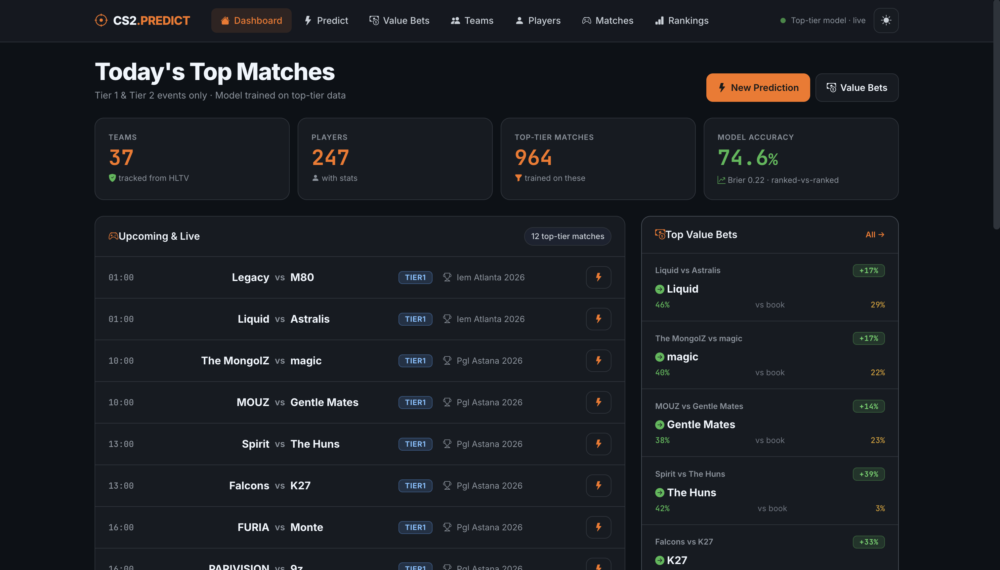
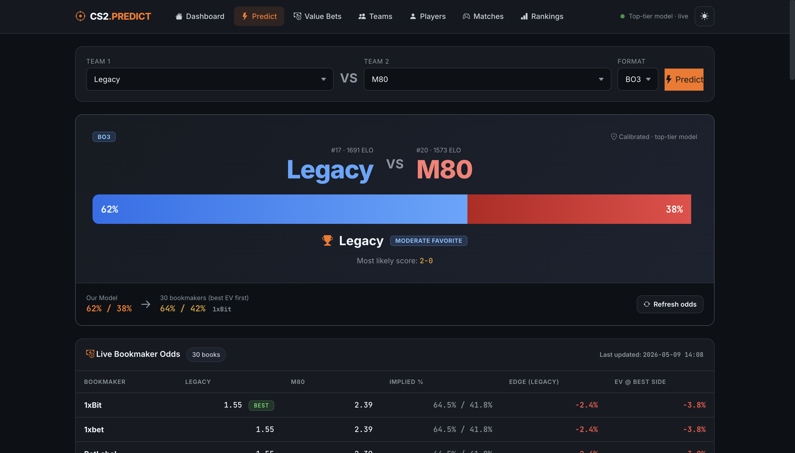
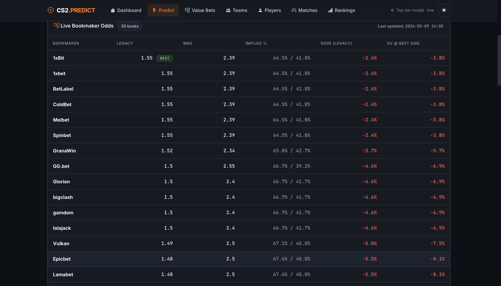
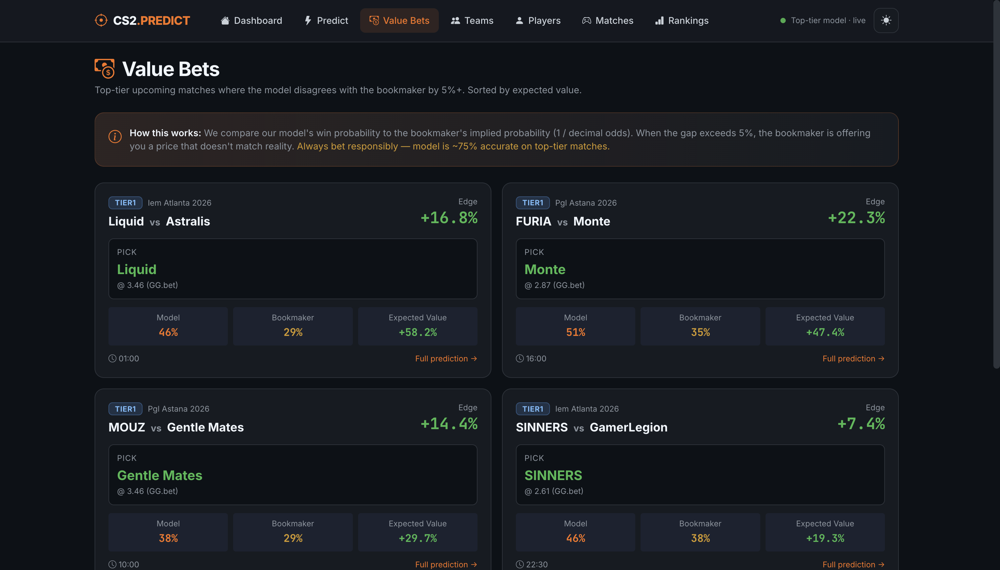

# CS2 Match Predictor

A Flask web application that predicts professional Counter-Strike 2 match outcomes using an 8-factor weighted model with isotonic-regression probability calibration, then surfaces live multi-bookmaker odds and flags value bets.

## Description

The app scrapes live data from HLTV (rankings, results, rosters, map pools, multi-book odds) and PandaScore (rosters, fallback odds), computes ELO ratings + 7 other prediction factors, and outputs a calibrated win probability for every upcoming top-tier match. Bookmaker odds from 1xbet, Melbet, GG.bet, Stake, Thunderpick, Pinnacle, and ~15 other books are compared against the model to find value bets.

**Cross-validated accuracy: 75.8% on 124 top-tier ranked-vs-ranked matches**, vs 67.7% for "always pick the higher-ranked team" baseline. Full evaluation methodology in `evaluate.py`; raw results in `eval_results.json`.

## Live Demo

🌐 **[https://cs2-predictor-k1ah.onrender.com](https://cs2-predictor-k1ah.onrender.com)**

> Free Render tier sleeps after 15 min of inactivity — first request may take ~30s to wake up.

## Screenshots

| Dashboard | Predict Page |
|-----------|--------------|
|  |  |

| Live Multi-Book Odds | Value Bets |
|---------------------|------------|
|  |  |

## Features

- **Match prediction** — 8-factor weighted model (ELO, world ranking, player quality, map pool, recent form, head-to-head, roster stability, LAN performance) with dynamic weight redistribution when factors lack data
- **Probability calibration** — isotonic regression trained on historical results so a "70%" prediction actually means ~70% over time
- **Live multi-bookmaker odds** — scrapes 20+ books from HLTV's match-page widget in real time, highlights the best price for each side, computes EV per book
- **Value bet detection** — flags matches where the model disagrees with the bookmaker by ≥5%, sorted by expected value
- **Score line probabilities** — bo1 / bo3 / bo5 score predictions (2-0, 2-1, etc.) with "win at least 1 map" calculations
- **Player trend page** — Linemate-style hit-rate bars for last 5 / 10 / 20 games + kill prop line suggestions calibrated to typical 1xbet/Melbet ladders (15.5, 17.5, 19.5, 21.5, …)
- **Light/dark theme toggle** with localStorage persistence and anti-flash boot
- **Top-tier filter everywhere** — model trains on majors + tier 1 + tier 2 only (excludes ~73% noisy qualifier matches)
- **Honest accuracy reporting** — `evaluate.py` runs 5-fold cross-validation, retraining the calibrator on each fold to avoid in-sample inflation

## Technology Stack

- **Backend:** Python 3.11, Flask 3, Jinja2 templates
- **Frontend:** Tailwind CSS via CDN, Inter & JetBrains Mono via Google Fonts, vanilla JavaScript
- **Data:** SQLite (~3 MB, ~2,900 historical matches, 30 ranked teams, 250+ players)
- **Model:** scikit-learn IsotonicRegression on top of a hand-tuned 8-factor scorer
- **Scraping:** `curl_cffi` with Chrome 124 TLS fingerprint to bypass HLTV's Cloudflare protection
- **Production server:** gunicorn (2 workers, 60s timeout)
- **Deployment:** Render.com (free tier, auto-deploys from GitHub via `render.yaml`)

## Data Sources

| Source | Used for | URL |
|--------|---------|-----|
| HLTV.org | World rankings, match results, upcoming matches, rosters, map pool win rates, multi-book odds widget | https://www.hltv.org |
| PandaScore API | Team rosters, fallback betting odds | https://pandascore.co |
| Bookmaker affiliate odds (via HLTV widget) | 1xbet, Melbet, GG.bet, Stake, Pinnacle, Thunderpick, BetLabel, Spinbet, Vulkan, GranaWin, Roobet, BetBoom, BC.Game, ColdBet, gamdom, Fezbet | aggregated through HLTV |

All scrapers respect a 2-second per-request throttle.

## Setup / Running Locally

### Prerequisites

- Python 3.11 (3.10+ works)
- `pip` (or `uv` / `poetry`)

### Steps

```bash
# 1. Clone the repo
git clone https://github.com/<your-username>/cs2-predictor.git
cd cs2-predictor

# 2. Install dependencies
pip install -r requirements.txt

# 3. Run the web app
python webapp/app.py
# or with gunicorn:
gunicorn wsgi:app

# 4. Open http://localhost:8080
```

### Optional: refresh data

The DB ships pre-populated with recent data. To refresh manually:

```bash
python hltv_fetcher.py            # rankings, results, upcoming matches
python hltv_odds.py               # multi-book odds for upcoming matches
python advanced_predictor.py elo  # recompute ELO from match history
python build_calibrator.py        # retrain the probability calibrator
```

### Optional: background daemon

To keep data fresh every 30 min:

```bash
python auto_updater.py &
echo $! > updater.pid
tail -f updater.log
```

### Optional: run the accuracy evaluation

```bash
python evaluate.py --folds 5 --save eval_results.json
```

Outputs accuracy, Brier score, confusion matrix, reliability table, and baselines.

## Deployment (Render.com — free)

This repo is a one-click Render Blueprint thanks to `render.yaml` and `Procfile`:

1. Push the repo to GitHub
2. Sign up at https://render.com
3. New → Blueprint → connect your GitHub repo → deploy

Render auto-detects `render.yaml`, installs `requirements.txt`, runs `gunicorn wsgi:app`, and gives you a public `*.onrender.com` URL.

The free tier sleeps after 15 minutes of inactivity (~30s cold-start on first request after sleep). To set the optional PandaScore API key, add `PANDASCORE_API_KEY` in the Render dashboard's Environment tab.

## Repository Structure

```
.
├── webapp/
│   ├── app.py              # Flask routes + run_prediction orchestration
│   ├── templates/          # 11 Jinja2 templates (Tailwind via CDN)
│   └── static/             # currently empty (Tailwind via CDN)
├── advanced_predictor.py   # 8-factor model + ELO system
├── build_calibrator.py     # trains the isotonic calibrator
├── evaluate.py             # 5-fold cross-validation, baselines, reliability table
├── hltv_fetcher.py         # HLTV rankings/results/rosters/upcoming scraper
├── hltv_odds.py            # HLTV multi-bookmaker odds widget scraper
├── prop_odds.py            # Player-prop deep-link generator + cache schema
├── pandascore_api.py       # PandaScore API fallback for odds & rosters
├── auto_updater.py         # Optional 30-min refresh daemon
├── update_from_pandascore.py
├── cs2_data.db             # SQLite, ships pre-populated
├── calibrator.pkl          # trained IsotonicRegression
├── eval_results.json       # latest 5-fold CV output
├── schema.sql              # full DB DDL
├── wsgi.py                 # gunicorn entry point
├── Procfile                # Render / Heroku start command
├── render.yaml             # Render Blueprint
├── runtime.txt             # Python version pin
└── requirements.txt
```

## How the Model Works

`predict_match(team1, team2, format)` in `advanced_predictor.py` runs an 8-factor weighted score:

| # | Factor | Base weight | Source |
|---|--------|-------------|--------|
| 1 | ELO Rating | 25 | computed from all top-tier matches, K=32, tier-weighted (major × 1.5, tier 1 × 1.2) |
| 2 | World Ranking | 15-35 | HLTV ranking; scales up when rank gap ≥ 10 |
| 3 | Player Quality | 20 | weighted: rating × 0.5 + ADR × 0.3 + KAST × 0.2 |
| 4 | Map Pool | 5-15 | avg of best 3 map win rates compared |
| 5 | Recent Form | 3-15 | last 20 matches, recency-weighted, opponent-strength adjusted |
| 6 | Head-to-Head | 5-15 | dynamic weight by match count, closeness-dampened |
| 7 | Roster Stability | 5 | 0.7-1.0 based on days since last roster change |
| 8 | LAN Performance | 5 | LAN win-rate vs online win-rate ratio |

Weights are redistributed when a factor lacks data (e.g., no H2H history → its weight goes to the other 7). Raw score is then run through sigmoid compression for extreme cases, clamped to [15%, 85%], format-adjusted (BO1 × 0.85, BO5 × 1.15), and finally passed through the isotonic calibrator.

## Accuracy: The Honest Numbers

5-fold cross-validation on 124 top-tier ranked-vs-ranked matches, calibrator retrained per fold:

| Metric | Value |
|--------|-------|
| Accuracy | **75.8%** (94 / 124) |
| Brier score | 0.160 (random = 0.25, perfect = 0) |
| Precision (team1 wins) | 79.0% |
| Recall (team1 wins) | 74.2% |

Compared to baselines on the same set:

| Baseline | Accuracy |
|----------|---------|
| Always pick higher-ranked team | 67.7% |
| Always pick higher-ELO team | 74.2% |
| Random | 50% |

The 8-factor model beats ELO-alone by only 1.6 points. Most predictive power comes from ELO. The 7 secondary factors add small but real value.

**Reliability** (out-of-sample, calibrated):

| Predicted | Actual | Verdict |
|-----------|--------|---------|
| 40% | 39% | ✓ well-calibrated |
| 63% | 70% | slightly under-confident |
| 70% | 56% | overconfident |
| 81% | 60% | very overconfident |

The model is reliable in the 40-65% range but overconfident at the top end. Calibration helped but didn't fully fix this.

## Known Issues

- **Free-tier deployment sleeps** after 15 minutes — cold start ~30 seconds
- **Player kill props can't be scraped live** — 1xbet/Melbet have strong anti-bot. We provide deep-link buttons to verify lines manually instead.
- **Model overconfident at high probabilities** — when it says 85%, real rate is ~60%. The calibration training set (122 matches) is small; would need 500+ matches for tighter calibration at the tails.
- **Time leakage in evaluation** — ELO uses the full match DB, including future matches when predicting past rows. A proper walk-forward eval would likely drop accuracy by 1-3 points.
- **HLTV DOM-dependent** — if HLTV restructures their odds widget, the scraper breaks until updated.
- **Small test set** — 124 matches gives ~±7% confidence interval on the accuracy estimate.

## Future Improvements

- Replace the hand-tuned weighted sum with **XGBoost / LightGBM** trained on engineered pre-match features (likely +2-4 points accuracy with proper walk-forward CV)
- **Walk-forward evaluation** that recomputes ELO at each match's timestamp instead of using the full DB
- **Bet-tracking module** — log every prediction with a timestamp, reveal the actual outcome later, build a live leaderboard of model accuracy vs bookmaker EV
- **Per-map predictions** when map veto is known
- **More bookmakers** — direct Pinnacle API integration (sharpest book) for cleaner reference odds
- **Mobile PWA** — currently the layout works on mobile but isn't optimized for touch

## Author

Built by Khantushig (junior at AUM, data science track) as the final project for the Spring 2026 AI Builder Bootcamp / Capstone.

## License

MIT — feel free to fork and improve.
